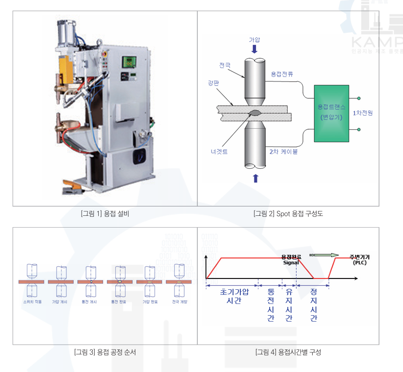

# KAMP Spot 용접 데이터 — 공식 가이드 기반 공정·설비·물리량 정의

## 먼저 함께 볼 그림

**이 문서를 읽고 공정을 해석하는 AI Agent는 아래 PNG를 이미지 열람 도구로 직접 열어 함께 확인한다. 경로·대체 텍스트만 읽고 그림을 확인했다고 판단하지 않는다.**

- 이미지: [용접방식.png](../data/용접방식.png). 경로는 이 문서가 있는 `docs/` 기준이다.
- 확인할 내용: 위쪽의 설비·전극·강판 구성과 아래쪽의 공정 순서·시간 구성.
- 아래 공정 순서는 `스위치 작동 → 가압 개시 → 통전 개시 → 통전 완료 → 가압 완료 → 전극 개방`이다. 통전 종료 후에도 가압이 유지되는 구간을 확인한다.
- 그림의 동작 단계나 시간 구간을 Raw의 네 행에 직접 대응시키지 않는다. 반복 신호를 해석하는 공정 배경으로 사용한다.
- 이미지를 열 수 없으면 그 사실을 명시하고, 그림을 보았다고 가정해 설명하지 않는다.

## 0. 문서 목적

이 문서는 KAMP 「용접기 AI 데이터셋」 공식 분석실습 가이드북에 명시된 내용만을 바탕으로,
현재 용접 데이터를 분석하는 AI Agent에게 다음 정보를 제공하기 위한 문서이다.

- 어떤 용접 공정인지
- 실제 설비가 어떤 순서로 동작하는지
- 각 데이터 Column이 어떤 물리량을 의미하는지
- 각 물리량이 Spot 용접에서 어떤 역할을 하는지
- 데이터가 어떤 방식으로 수집되었는지
- 현재 공식 문서만으로 확정할 수 없는 사항은 무엇인지

중요:

이 문서는 공정구조에 대한 가설을 추가하는 문서가 아니다.

특히 다음과 같은 관계는 공식 문서에 명시되어 있지 않으므로 사실로 취급하지 않는다.

- 1 Raw row = 1 Spot
- 4 Raw rows = 1 제품
- 4 Raw rows = 공식 4지점
- 8초 = 제품 한 개의 생산시간
- 16 rows = 하나의 공정 cycle
- idx mod 4 = 물리적인 Spot 번호

이러한 관계는 후속 데이터 분석을 통해 별도로 검증해야 한다.

---

# 1. 제조 분야와 공정

공식 제조 분야:

`자동차 부품 용접`

공식 공정:

`Spot 용접`

공식 가이드에서는 Spot 용접을 다음과 같이 설명한다.

용접하려는 재료를 전극(TIP) 사이에 놓고 가압한 상태에서 전류를 흘리면,
재료와 접촉부의 전기저항에 의해 저항열이 발생한다.

이 저항열을 이용하여 접합부를 가열하고 융합하여 두 금속을 접합한다.

Spot 용접은 다음 특징을 가진다고 설명한다.

- 작업속도가 빠름
- 재료비 절감 가능
- 용접 표면이 비교적 평평하고 깨끗함
- 자동차 차체부품에 많이 이용됨

현재 데이터가 수집된 제조 분야 역시 자동차 부품 용접이다.

다만 공식 문서에는 다음 정보가 공개되어 있지 않다.

- 정확한 자동차 부품 명칭
- 차량 모델
- 부품의 형상
- 각 Spot의 실제 공간 좌표
- 4지점의 실제 부품상 위치

따라서 `Item No = 65235-25800`의 정확한 자동차 부품명을 추정하지 않는다.

---

# 2. 현장의 자동화 수준

공식 가이드에서는 해당 현장을 다음과 같이 설명한다.

`로봇 기반의 용접 자동화 공정이 아닌 작업자 기반 용접작업`

즉 원 데이터가 수집된 현장은 작업자가 용접작업을 수행하는 공정이다.

따라서 데이터의 반복 패턴을 다음과 같이 자동으로 해석하면 안 된다.

`반복 패턴 = Robot Teaching Program`

공정조건 데이터 자체는 PLC 및 MES와 연동하여 수집되었다.

공식 가이드에서 명시된 정보:

- 전류
- 가압력
- 통전시간

은 PLC와 연동하여 MES에 수집한다.

소재 두께 정보는:

`ERP-MES 작업 오더 데이터`

를 이용한다.

품질검사는 별도의 검사 인원이 수행한다.

검사자는:

- 양품 / 불량품
- 불량품의 등급

을 분류하고 기록하였다.

---

# 3. Spot 용접 설비의 주요 구성

공식 가이드의 Spot 용접 구성도에는 두 전극(TIP) 사이에 판재를 위치시키고
전극을 이용하여 판재를 가압하는 구조가 제시되어 있다.

개념적 구조는 다음과 같다.

Upper Electrode / TIP
        ↓ 가압
-----------------
     판재
-----------------
     판재
-----------------
        ↑ 가압
Lower Electrode / TIP

가압 상태에서 전류가 흐르면 판재 접촉부에서 저항열이 발생한다.

이 열에 의해 접합부가 가열되고 용접부가 형성된다.

공식 가이드에서는 Spot 용접의 주요 4대 요소를 다음과 같이 정의한다.

1. 용접전류
2. 통전시간
3. 가압력
4. 전극

현재 Raw Data에는 이 중 다음 값이 직접 존재한다.

- 용접 가압력
- 용접전류
- 전압
- 통전시간

전극의 상태 자체는 데이터에 존재하지 않는다.

---

# 4. 설비 작업 시작 절차

공식 가이드에서 설명한 실제 작업 시작 순서는 다음과 같다.

1. 타이머 전원 스위치를 켠다.
2. 급수 밸브를 개방한다.
3. 에어 밸브를 개방한다.
4. 용접 전원 스위치를 켠다.
5. Gun 스위치를 누르면서 설비 동작을 확인한다.
6. 초기 Nugget 시험을 수행한다.
7. 시험 결과를 이용하여 설비를 조정한다.
8. 양호한 상태가 확인되면 연속 작업을 실시한다.

따라서 실제 생산 데이터 시작부에는 설비 초기화 또는 조건 확인과 관련된 상태가
포함될 가능성이 있을 수 있으나,

`Raw Data의 첫 N행이 초기 Nugget 시험이다`

라고 공식 문서는 명시하지 않는다.

따라서 첫 4행, 첫 100행 등을 자동으로 초기작업으로 라벨링하지 않는다.

---

# 5. 한 번의 Spot 용접 동작 순서

공식 가이드는 한 번의 용접 동작을 시간적으로 다음 네 단계로 설명한다.

1. 초기 가압시간
2. 통전시간
3. 유지시간
4. 정지시간

이를 개념적으로 표현하면 다음과 같다.

초기 가압
    ↓
통전
    ↓
유지
    ↓
정지
    ↓
다음 작동

---

# 6. 초기 가압시간

공식 설명:

`판과 판을 밀착시키는 초기 가압시간`

이다.

즉 용접전류를 흘리기 전에 전극을 이용하여 두 판재를 서로 밀착시키는 단계이다.

이 단계의 목적은 판재를 용접 가능한 접촉상태로 만드는 것이다.

공식 가이드에는 초기 가압시간의 실제 시간값은 제공되지 않는다.

또한 Raw Data의 `weld force` 값이 초기 가압 단계의 어느 시점에서 측정된 값인지,
평균값인지, 최대값인지 등은 명시되어 있지 않다.

---

# 7. 통전시간

초기 가압 이후 전극을 통해 실제 용접전류를 흐르게 한다.

이 시간을 공식 데이터에서는:

`weld time`

으로 정의한다.

공식 정의:

`전극에 용접전류를 통한 시간`

단위:

`ms`

공식 수집 범위:

`30 ~ 120 ms`

통전 중에는 전류가 흐르면서 접촉부에서 저항열이 발생한다.

---

# 8. 유지시간

통전이 종료된 후에도 즉시 전극을 떼는 것이 아니라
용접부가 응고하는 동안 일정 시간 가압상태를 유지한다.

공식 가이드 표현:

`용접부가 응고하는 데 소요되는 유지시간`

즉:

전류 OFF
≠
즉시 전극 해제

이다.

통전이 끝난 뒤에도 응고 과정이 존재한다.

현재 Raw Data에는 별도의:

- hold time
- 유지시간

Column은 존재하지 않는다.

따라서 유지시간 자체를 현재 데이터에서 직접 측정할 수 없다.

---

# 9. 정지시간

유지시간 이후 다음 용접작업이 시작될 때까지 정지시간이 존재한다.

공식 설명:

`다시 처음 작동할 때까지의 정지시간`

이다.

현재 Raw Data에는 별도의:

- stop time
- idle time

Column이 없다.

따라서 정지시간 역시 직접 관측할 수 없다.

---

# 10. 작업 종료 절차

공식 가이드에서 작업이 완료되면 다음 절차를 수행한다.

1. 타이머 전원 스위치 OFF
2. 용접 전원 스위치 OFF
3. 급수 밸브 잠금
4. 에어 밸브 잠금
5. 전원 종료

따라서 Spot 용접 설비는 단순히 전류만 제어하는 장치가 아니라,

- 전기
- 압축공기
- 냉각수
- 전극
- Gun
- Timer

등이 함께 동작하는 설비이다.

---

# 11. Spot 용접에서 발생하는 열

공식 가이드에서는 Spot 용접이 전기저항에 의해 발생하는 열을 이용한다고 설명한다.

또한 발열량은 전류의 제곱에 비례한다고 명시한다.

즉 공식적으로 중요한 관계는:

발열량 ∝ I²

이다.

따라서 전류는 용접결과에 매우 중요한 변수로 설명된다.

가이드는 판재의 두께가 증가할수록 필요한 전류도 증가한다고 설명한다.

주의:

현재 Raw Data에 있는 하나의 Current 값만으로 실제 시간에 따른 열 발생량 전체를
정확하게 복원할 수 있다고 공식 가이드가 말하는 것은 아니다.

---

# 12. Weld Current — 용접전류

Column:

`weld current(kA)`

공식 정의:

`용접 지점에서 측정된 전류`

단위:

`kA`

공식 수집 범위:

`12.00 ~ 18.00 kA`

공식 가이드의 물리적 설명:

- Spot 용접에서는 주로 교류전류를 사용한다.
- 발열량은 전류의 제곱에 비례한다.
- 따라서 전류는 용접결과에 중요한 변수이다.
- 판재가 두꺼울수록 필요한 전류가 증가한다.

따라서 Current는 저항열 발생과 직접적으로 관련되는 주요 공정변수이다.

하지만 공식 문서에서는 Raw의 Current 값이 다음 중 무엇인지는 구체적으로 정의하지 않는다.

- 순간값
- 평균값
- RMS 값
- 최대값
- 72ms 구간의 대표값

따라서 데이터만으로 측정방식을 추가 추정하지 않는다.

---

# 13. Weld Time — 통전시간

Column:

`weld time(ms)`

공식 정의:

`전극에 용접전류를 통한 시간`

단위:

`ms`

공식 수집 범위:

`30 ~ 120 ms`

공식 가이드의 설명:

통전시간은 Nugget의 크기와 관련되어 있으며
발열과 방열의 적절한 균형을 조절하는 공정변수이다.

또한 열전도가 좋은 재료에서는:

`대전류 + 짧은 통전시간`

형태가 사용될 수 있다고 설명한다.

따라서 Weld Time은 단순한 데이터 수집시간이 아니라
용접전류가 실제로 공급되는 공정조건이다.

---

# 14. Weld Force — 용접 가압력

Column:

`weld force(bar)`

공식 정의:

`용접 지점에서 가해지는 압력`

단위:

`bar`

공식 수집 범위:

`1.00 ~ 12.00 bar`

주의:

Column 명칭은 `weld force`이지만 공식 데이터 속성 정의에서는
단위를 `압력(bar)`로 제공한다.

따라서 현재 데이터의 값을 Newton 등의 실제 힘 단위로 직접 해석하지 않는다.

공식 가이드의 물리적 설명:

가압력이 증가하면 접촉부의 저항이 감소할 수 있다.

그 결과:

가압력 증가
→ 저항 감소
→ 유효 발열량 감소 가능

이라고 설명한다.

반대로 가압력이 너무 작으면:

접촉저항 분포가 불균일
→ Spark 발생 가능

하므로 적절한 조절이 필요하다고 설명한다.

따라서 공식 가이드 자체에서도 가압력은
단순히 높을수록 좋거나 낮을수록 좋은 변수로 설명되지 않는다.

---

# 15. Weld Voltage — 용접전압

Column:

`weld Voltage(v)`

공식 정의:

`용접 지점에서 측정된 전압`

단위:

`V`

공식 수집 범위:

`1.50 ~ 3.50 V`

공식 가이드의 데이터 정의에는 Voltage가 명시되어 있다.

다만 Spot 용접의 4대 요소를 설명하는 부분에서는:

- 전류
- 통전시간
- 가압력
- 전극

을 주요 요소로 설명하고,
Voltage에 대한 별도의 상세 물리 설명은 제공하지 않는다.

따라서 공식 가이드만을 근거로 할 경우
Voltage 변화가 특정 불량을 의미한다고 직접 해석하지 않는다.

Voltage는 공식적으로:

`용접 지점에서 측정된 전압`

이라는 수준까지 확정한다.

---

# 16. Electrode — 전극

전극은 Raw Data의 Column에는 없지만
공식 가이드에서 Spot 용접의 4대 요소 중 하나로 설명한다.

공식적으로 설명된 전극 관련 영향:

- 전극 TIP의 접촉면적은 전류밀도와 관련된다.
- 전류밀도는 용접품질에 영향을 미친다.
- 전극의 냉각상태는 용접품질에 영향을 미친다.
- 냉각상태는 전극의 마모율에도 영향을 미친다.

현재 데이터에는 다음 변수가 존재하지 않는다.

- Electrode ID
- Electrode TIP 면적
- Electrode 마모량
- Electrode 온도
- Cooling water 온도
- Cooling water flow
- Electrode 교체 시점

따라서 이러한 상태는 공식적으로 중요한 변수임에도
현재 Raw Data에서는 직접 관측되지 않는다.

---

# 17. Thickness 1 / Thickness 2 — 소재 두께

Column:

`Thickness 1(mm)`
`Thickness 2(mm)`

공식 정의:

`용접하고자 하는 강판의 두께`

단위:

`mm`

공식 수집 범위:

`0.3 ~ 2.3 mm`

공식 가이드에서는 소재 두께가 용접 조건과 관련된 변수라고 설명한다.

특히 판재가 두꺼워질수록 필요한 용접전류가 커진다고 설명한다.

현재 가이드의 해당 데이터에서는 소재 두께가 모든 sample에서 동일한 값을 가지기 때문에
2차 가공 데이터에서는 모델 입력에서 제외했다고 설명한다.

---

# 18. idx

Column:

`idx`

공식 정의:

`생산순번`

공식 가이드에서는 생산순번이라는 정의까지만 제공한다.

따라서 idx를 이용하여 행의 순서를 볼 수는 있지만,

다음은 공식적으로 확인되지 않았다.

- idx 1 증가 = 정확히 8초 경과
- idx 1 증가 = 한 Spot 완료
- idx 4 증가 = 제품 하나 완료
- idx reset = 제품 교체

따라서 idx는 우선 순서정보로만 사용한다.

---

# 19. Machine_Name

Column:

`Machine_Name`

공식 정의:

`생산설비`

현재 데이터에서는 `Spot-01`이라는 설비명이 사용된다.

설비명 자체가 실제 기계의 세부 제어상태나 작업위치를 의미하는 것은 아니다.

---

# 20. Item No

Column:

`Item No`

공식 정의:

`생산품목`

따라서 Item No는 공식적으로 생산품목을 나타낸다.

가이드는 Item No를:

`개별 physical product instance ID`

라고 정의하지 않는다.

따라서 동일 Item No가 여러 행 반복된다는 사실만으로
각 행이 같은 실제 제품을 의미한다고 해석하지 않는다.

---

# 21. working time

Column:

`working time`

공식 정의:

`작업시간`

현재 공개 데이터에서는 날짜 수준 정보가 주로 제공된다.

가이드에서는 이 Column이 공정의 정확한 시·분·초 timestamp라고 설명하지 않는다.

따라서 실제 row 간 시간간격을 working time에서 복원하지 않는다.

---

# 22. 공식 데이터 수집 장비

공식 수집장비:

`Spot 용접 공정대상 PLC-MES Data 및 Mongo DB`

공식 수집기간:

`2020/03/24 ~ 2020/04/07`

약 15일이다.

공식 가이드는 공정데이터가 PLC/MES 기반으로 수집되고
저장 시스템으로 MongoDB가 사용되었다고 설명한다.

---

# 23. 공식 수집 주기

공식 가이드에 기록된 수집 주기는 다음과 같다.

`약 8초 주기로 4지점에서의 센서 데이터 수집`

그리고:

`각 지점 별 0.072초 동안 데이터를 수집`

한다.

이는 현재 공정구조 분석에서 매우 중요한 공식 metadata이다.

하지만 이 문장은 다음 사항을 명시하지 않는다.

- 8초가 제품 하나를 완성하는 시간인지
- 8초가 한 Spot 간격인지
- 8초가 네 지점 전체의 작업시간인지
- 4지점이 한 제품의 네 용접위치인지
- 4지점이 센서 내부 네 sampling point인지
- 한 지점이 Raw Data 한 행인지

따라서 위 사항을 공식 사실로 취급하지 않는다.

---

# 24. 0.072초와 weld time 72ms의 관계

공식 가이드에는 두 정보가 별도로 존재한다.

첫째:

`각 지점별 0.072초 동안 데이터를 수집`

둘째:

`weld time = 전극에 용접전류를 통한 시간`

이며 기술통계에서 weld time의 최빈값은:

`72 ms`

이다.

수치상:

0.072 second = 72 ms

로 일치한다.

그러나 공식 문서에서는 다음 문장을 직접 제시하지 않는다.

`각 지점의 0.072초 수집시간 = weld time 72ms`

따라서 두 수치의 일치는 중요한 관찰사항이지만,
공식적으로 동일한 개념이라고 확정하지 않는다.

후속 분석에서는 이 관계를 검증 가능한 가설로 취급한다.

---

# 25. 8초와 제품 생산시간의 관계

공식 가이드의 표현은:

`수집 주기 : 약 8초 주기로 4지점에서의 센서 데이터 수집`

이다.

가이드에는:

`제품 하나 생산에 약 8초가 소요된다`

라는 문장이 없다.

따라서 다음 계산은 수행하지 않는다.

8 / 0.072 ≈ 111

→ 약 111행 = 제품 하나

0.072초는 공식적으로 `각 지점에서 데이터를 수집하는 시간`이며,
8초는 공식적으로 `수집 주기`라고만 설명되어 있다.

두 값을 나누어 Raw row 개수를 계산할 근거는 현재 없다.

---

# 26. 공식 용접시간 구성과 Raw row의 관계

공식 가이드가 설명하는 물리적인 용접 동작은:

초기 가압
→ 통전
→ 유지
→ 정지

이다.

하지만 Raw Data의 한 행이 이 네 단계 중 어느 하나를 의미한다고 설명하지 않는다.

오히려 한 Raw row에는 동시에:

- weld force
- weld current
- weld Voltage
- weld time

이 존재한다.

따라서 현재 단계에서는:

`한 행 = 초기 가압 단계`
`다음 행 = 통전 단계`
`다음 행 = 유지 단계`

와 같은 형태로 복원하지 않는다.

기계 동작 정보는 Raw sequence에서 반복되는 신호를 해석하기 위한
도메인 기준으로만 사용한다.

---

# 27. 공식 품질 문제

공식 가이드에서 실제 현장의 용접 불량 문제로 제시한 예시는 다음과 같다.

- 과한 용접 파임
- 판의 들뜸
- 용접 불균일
- 용접 Crack

이러한 불량으로 인해:

- 재작업
- 재료비 증가
- 인건비 증가
- 고객 Claim

등의 문제가 발생한다고 설명한다.

공식 문서에서는 위 불량 각각이
어떤 정확한 Current/Voltage/Force/Time 조건에서 발생하는지는 제시하지 않는다.

따라서 해당 인과관계는 별도의 도메인 조사 및 데이터 분석이 필요하다.

---

# 28. 품질 검사

공식 가이드에서는 해당 현장의 검사가 육안에 의존하고 있었다고 설명한다.

별도 검사 인원이 투입되어:

- 양품
- 불량품
- 불량품 등급

을 분류하여 기록하였다.

그러나 공개된 Raw Data에는 개별 제품의 양품/불량 여부가 표시되어 있지 않다.

공식 설명:

`제품 각각에 대한 불량 선별값 (표시 없음 / Unlabeled)`

이다.

대신:

`일별 불량 수 및 불량 유형`

정보를 알 수 있다고 설명한다.

따라서 일별 Result를 개별 Raw row의 label로 변환해서는 안 된다.

---

# 29. 1차 가공 데이터

파일:

`Welding Data Set_01.xlsx`

공식 가이드에서는 이 파일을 비식별화 및 품질 전처리를 수행한
1차 가공 데이터로 설명한다.

주요 Column:

- idx
- Machine_Name
- Item No
- working time
- Thickness 1
- Thickness 2
- weld force
- weld current
- weld Voltage
- weld time

---

# 30. 2차 가공 데이터 scaled_data

공식 2차 가공 데이터:

`scaled_data.csv`

가이드에서는 다음 변수들이 모든 sample에서 동일하므로 모델 입력에서 제외한다고 설명한다.

- 생산품목
- 작업시간
- 소재 두께

따라서 다음 4개 공정변수만 남긴다.

- weld force
- weld current
- weld Voltage
- weld time

그리고 sklearn의:

`MinMaxScaler`

를 사용하여 최소-최대 정규화를 적용한다.

공식 설명:

`각 특성에 MinMaxScaler를 사용하여 최소-최대 정규화를 적용`

한다.

주의:

이 문서는 scaling 방식 자체만 공식 사실로 기록한다.

현재 프로젝트에서 보유한 Raw Data와 scaled_data의
행 대응 관계나 dataset version 관계는 별도의 provenance 검증 대상이다.

---

# 31. 공식 수집범위

| Column | 공식 의미 | 공식 범위 | Unit |
|---|---|---:|---|
| Thickness 1 | 소재 두께 1 | 0.3 ~ 2.3 | mm |
| Thickness 2 | 소재 두께 2 | 0.3 ~ 2.3 | mm |
| weld force | 용접 지점에서 가해지는 압력 | 1.00 ~ 12.00 | bar |
| weld current | 용접 지점에서 측정된 전류 | 12.00 ~ 18.00 | kA |
| weld Voltage | 용접 지점에서 측정된 전압 | 1.50 ~ 3.50 | V |
| weld time | 전극에 용접전류를 통한 시간 | 30 ~ 120 | ms |

---

# 32. 공식적으로 확인되는 물리적 관계 요약

## Current

공식 설명:

Current 증가
→ 저항발열 증가

특히 발열량은 Current²에 비례한다고 설명한다.

두꺼운 판재에서는 더 큰 전류가 필요하다고 설명한다.

---

## Weld Time

공식 설명:

통전시간
→ 발열과 방열의 균형에 영향
→ Nugget 형성에 영향

열전도가 좋은 재료에서는 대전류를 짧은 시간 동안 사용하는 방식이 가능하다고 설명한다.

---

## Weld Force

공식 설명:

Force 증가
→ 접촉저항 감소
→ 유효발열량 감소 가능

Force가 너무 작음
→ 접촉저항 분포 불균일
→ Spark 발생 가능

---

## Electrode

공식 설명:

전극 TIP 접촉면적
→ 전류밀도에 영향
→ 용접품질에 영향

전극 냉각상태
→ 용접품질에 영향
→ 전극 마모율에 영향

---

## Voltage

공식 데이터 정의:

용접 지점에서 측정된 전압

공식 가이드는 Voltage와 특정 불량 사이의 세부 물리관계는 별도로 설명하지 않는다.

---

# 33. 현재 관측할 수 없는 중요한 설비 상태

공식 가이드는 다음 요소들이 품질에 영향을 준다고 설명하지만,
Raw Data에는 직접적인 Column이 존재하지 않는다.

- 전극 접촉면적
- 전극 냉각상태
- 전극 마모상태
- 실제 초기 가압시간
- 실제 유지시간
- 실제 정지시간

따라서 현재 Raw Data의 4개 공정변수만으로
설비의 전체 물리상태를 완전히 관측한다고 가정하지 않는다.

---

# 34. AI Agent가 과대해석하면 안 되는 사항

공식 문서에 없는 다음 내용을 사실로 생성하지 않는다.

1. 한 행이 정확히 한 Spot이라는 주장
2. 4행이 한 제품이라는 주장
3. 4행이 공식 4지점이라는 주장
4. 8초가 제품 하나의 생산시간이라는 주장
5. 0.072초마다 새로운 Raw row가 생성된다는 주장
6. 8 / 0.072 = 111이므로 111행이 한 제품이라는 주장
7. idx mod 4가 Spot 위치라는 주장
8. lag16이 4지점 × 4제품 구조라는 주장
9. 첫 4행이 초기 Nugget 시험이라는 주장
10. 특정 Current/Voltage/Force 값이 특정 불량을 의미한다는 주장
11. Raw row별 양품/불량 label이 존재한다는 주장
12. 빈도가 높은 공정영역이 양품영역이라는 주장

---

# 35. 후속 실험에서 공식 도메인 정보를 사용하는 방법

향후 데이터 분석에서는 공식 기계 동작을
미리 정답으로 강제하는 것이 아니라
발견된 데이터 패턴을 해석하는 기준으로 사용한다.

예:

데이터에서 반복적인 Force/Current/Voltage/Time 패턴 발견
→ 실제 Spot 설비가 반복 동작한다는 공식 정보와 비교

특정 구간에서 Force 변화 발견
→ 초기 가압 및 electrode contact와 관련 가능성 검토

특정 구간에서 Current/Time 변화 발견
→ 공식적으로 저항발열에 중요한 변수라는 사실과 비교

반복 간격 발견
→ 공식 `약 8초 / 4지점` metadata와 정합성 검토

그러나 데이터에서 해당 대응이 검증되기 전까지
Spot 번호, 제품 번호, cycle 번호를 생성하지 않는다.

---

# 36. 핵심 공식 컨텍스트 요약

본 데이터는 자동차 부품을 대상으로 한 작업자 기반 Spot 용접공정에서 수집되었다.

용접은 두 전극 사이에 판재를 두고 가압한 상태에서 전류를 흘려
접촉부에서 발생하는 저항열을 이용하는 방식이다.

설비의 한 번의 용접 동작은 공식적으로:

초기 가압
→ 통전
→ 유지
→ 정지

순서로 설명된다.

Spot 용접의 핵심 요소는:

- 용접전류
- 통전시간
- 가압력
- 전극

이다.

현재 Raw Data에서 직접 관측되는 주요 공정변수는:

- weld force
- weld current
- weld Voltage
- weld time

이다.

공식 데이터 수집 metadata는:

- 약 8초 주기
- 4지점 센서 데이터 수집
- 각 지점별 0.072초 수집

이다.

그러나 공식 문서는 이 수집구조와 Raw row의 정확한 매핑을 제공하지 않는다.

따라서 후속 실험에서는
공정구조를 데이터에서 독립적으로 검증한 후에만
cycle/phase 관련 Feature를 생성한다.